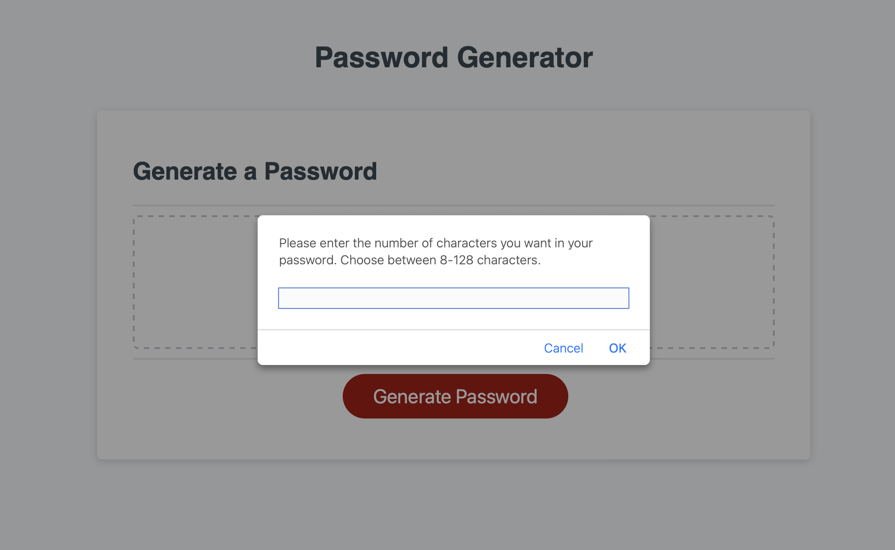

# Random Password Generator

## Description

The purpose of this application is to generate random passwords based on specific criteria: length of the password must be at least 8 characters and no more than 128 characters, the user must be able to choose the character types to include in the password (lowercase, uppercase, numeric, and/or special characters). I was given a JavaScript starter code, which I had to modify in order to create this application. 

## Features

When the user clicks on "Generate Button", they are presented with a series of prompts for password criteria: 
- length of the password where the user has to enter a humber between 8-128.
- character types to include in the password (lowercase, uppercase, numeric, special characters).

If the user enters a number outside of 8-128 range, a prompt appears that tells them to "enter a number between 8 and 128."

If the user enters a non-numeric value, "Your input has to be a number" prompt appears.

If the user does not select any of the character types to be included in the password, a prompt tells them that "You must pick at least one type of character."

When all prompts are answered, a password is generated that matches the selected criteria and is displayed on the page.

## Usage
User can find deployed app at [https://writteninnacode.github.io/Password_Generator/](https://writteninnacode.github.io/Password_Generator)

The repo can be found at [https://github.com/WrittenInnaCode/Password_Generator](https://github.com/WrittenInnaCode/Password_Generator)

